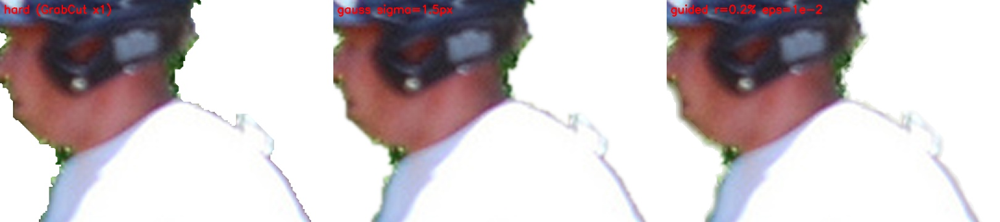
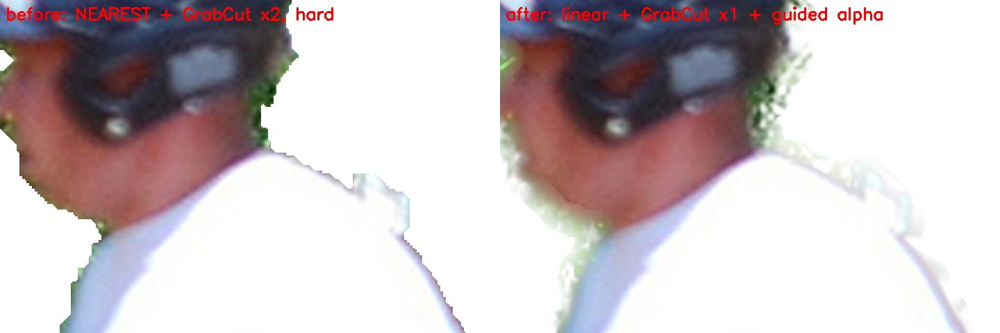

# 경계 품질 · 영상 흔들림 튜닝 — 2026-10-08

"배경 제거는 잘 되는데 튜닝하면 더 좋아질 것 같다"는 요청에 따라, 감으로 고치지 않고 **먼저 재고 → 고치고 → 다시 쟀다**.
측정 스크립트: [`scripts/experiments/edge_quality.py`](../../scripts/experiments/edge_quality.py) · 원자료: [`edge_quality_20261008.json`](./edge_quality_20261008.json)

## 1. 측정 방법

| 구분 | 데이터 | 정답 | 지표 |
|------|--------|------|------|
| 사진 | COCO val2017 사람 장면 150장(`coco_val_sel`, 사람이 화면의 1% 이상) + 같은 사진 **3배 확대본**(큰 사진 재현) | 사람 폴리곤 합집합 | IoU · **경계 F**(DAVIS 식, 허용 오차 = 대각선 0.4%) · 장당 시간 |
| 영상 | 같은 사진으로 만든 16프레임 클립 30개 — 프레임마다 3px 이동 + JPEG 재압축(q55~80) + 잡음 | 이동한 폴리곤 | 정답 IoU · **흔들림** = 1 − IoU(현재 마스크, 알려진 이동만큼 옮긴 이전 마스크) |

세그는 서빙과 같다: 긴 변 1280 으로 줄이고 CLAHE → YOLO26m-seg → 원본 크기로 되돌림.
COCO 폴리곤은 거칠어서 경계 F 의 절대값은 낮게 나온다 — **방식 사이 비교**가 목적이다.

## 2. 측정하다 찾은 문제

| 문제 | 영향 |
|------|------|
| **GrabCut 정제를 두 번** 하고 있었다 — `effect_applier` 노드가 `refine_mask` 를 하고, 이어 부르는 `apply_effects` 가 또 `refine_mask` | 경계가 한 번 더 깎이고 시간도 두 배 |
| 큰 사진의 마스크를 **최근접 보간**으로 원본 크기로 키움 | 4000px 사진이면 3px 계단 (정제가 실패하는 경우 그대로 남음) |
| 블러·배경 제거를 **0/255 마스크로 딱 잘라 합성** | 경계가 계단·톱니 |
| 영상은 프레임마다 독립 세그 | 경계가 떨리고, 한두 프레임 놓치면 깜빡임 |

## 3. 결과 — 사진 (150장)

| 방식 | 원본 경계 F | 원본 IoU | 장당 | 3배 경계 F | 3배 IoU | 장당 |
|------|-----------|---------|------|-----------|--------|------|
| 기존: 최근접 확대 + GrabCut 2번 | 0.406 | 0.760 | 1.18s | 0.419 | 0.758 | 2.81s |
| **GrabCut 1번** | **0.506** | **0.789** | **0.62s** | **0.478** | **0.786** | **1.51s** |
| + 선형 확대 | 0.505 | 0.789 | 0.61s | 0.477 | 0.786 | 1.46s |
| + 경계 안티앨리어싱 (채택) | 0.502 | 0.789 | 0.61s | 0.474 | 0.787 | 1.48s |

- **정제 한 번으로 경계 F +25%(0.406→0.506), IoU +0.029, 시간 절반.** 가장 큰 개선
- 선형 확대는 수치 차이 없음 (GrabCut 이 경계를 다시 정함). 정제가 없는 `remove_object` · GrabCut 실패 시 계단 방지용으로 유지
- 경계 안티앨리어싱은 거친 폴리곤 정답으로는 좋아짐이 잡히지 않는다(soft IoU −0.003). **눈으로 본 계단 제거**가 채택 이유 — 아래 그림

### 경계 처리 방식 비교 (3배 확대 사진, 흰 바탕 합성, 경계 2배 확대)

왼쪽부터 딱 자름 · **가우시안 1.5px(채택)** · 작은 가이드 필터. 처음 시도한 **넓은 가이드 필터**(이미지 밝기 경계를 따라 알파를 퍼뜨림)는
잔디 같은 질감 있는 배경을 끌어와 반투명 번짐 띠가 생겨 버렸다 (soft IoU −0.011):

## 4. 결과 — 영상 (클립 30개)

| 방식 | 정답 IoU | 흔들림 | 프레임당 추가 |
|------|---------|-------|-------------|
| 기존: 프레임마다 독립 | 0.805 | 0.0712 | — |
| 그냥 섞기 (현재 비중 0.4) | 0.782 ↓ | 0.0504 | 1ms |
| 흐름 보정 섞기 (0.4) | 0.810 | 0.0441 | 11ms |
| **흐름 보정 섞기 (0.3, 채택)** | **0.811** | **0.0357 (−50%)** | **10ms** |

- 그냥 섞으면 움직이는 대상 뒤에 꼬리가 남아 정확도가 떨어진다. **광학 흐름(Farneback, 긴 변 320)으로 이전 마스크를 현재 위치로 옮긴 뒤** 섞으면 흔들림은 절반, 정확도는 오히려 약간 오른다
- 이진 마스크라 현재 프레임 비중이 0.5 이상이면 임계값을 항상 현재 프레임이 정해 **아무 효과가 없다** (첫 구현의 실수 — 세 방식 수치가 똑같이 나와서 발견). 설정에서 0.5 이상을 막는다
- 장면이 크게 바뀌면(평균 밝기 차 > 40) 기억을 버린다
- 실제 영상 경로 처리 시간: 30프레임 1280px 기준 끔 29.2~32.1s · 켬 30.2~30.3s — 차이는 오차 범위

## 5. 바뀐 것

| 위치 | 변경 |
|------|------|
| `workflows/nodes.py` effect_applier | 선형 확대(`upscale_mask`), 정제 1번 후 `apply_effects(..., refine=False)` |
| `services/effects.py` | `upscale_mask`, `feather_alpha`(가우시안 σ = 긴 변 0.08%, 최소 1px), 블러는 알파 블렌딩, 배경 제거 알파 채널도 부드럽게 |
| `services/video_processor.py` | `TemporalSmoother`(flow · ema), 선택·직전 마스크 유지 뒤에 적용 (`remove_object` 는 제외) |
| 설정 | `VIDEO_TEMPORAL_SMOOTHING=flow` · `VIDEO_SMOOTHING_WEIGHT=0.3` (0 초과 0.5 미만) |

## 6. 남은 것 (다음 튜닝 후보)

- **영상 속도**: 프레임당 약 1초 — 대부분 프레임마다 도는 GrabCut. 흐름 스무딩 + 안티앨리어싱이 있으니 영상에서는 GrabCut 을 빼거나 몇 프레임마다만 해도 되는지 같은 방법으로 재 볼 것
- **머리카락처럼 가는 경계**: 지금 방식으로는 한계. SAM2 정밀화(YOLO 박스 → SAM2) 옵션 — 시간 비용 측정 필요
- 실제 촬영 영상(손떨림·조명 변화)으로 흔들림 재측정 — 지금은 합성 클립
