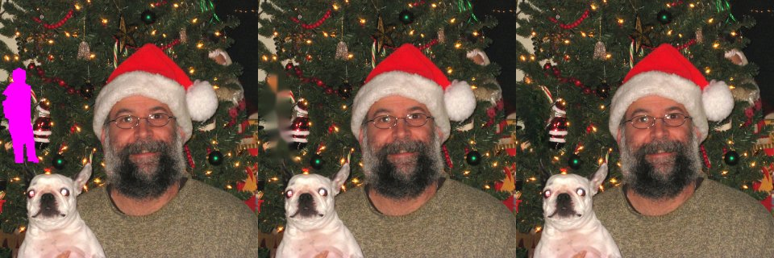
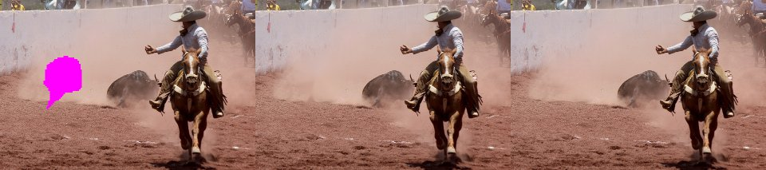

# 대상 지우기 빈자리 메우기 — Telea → LaMa (2026-10-09)

> 도구: [`scripts/experiments/inpaint_eval.py`](../../scripts/experiments/inpaint_eval.py) · 원자료 [`inpaint_eval_20261009.json`](./inpaint_eval_20261009.json)

## 문제

"오른쪽 사람 지워줘"처럼 대상을 지우면 빈자리를 OpenCV **Telea** 로 메웠다. Telea 는 테두리 색을 안쪽으로 번지게 칠할 뿐이라
큰 물체를 지우면 뭉개진 얼룩이 남았다 (사용자 가이드에도 한계로 적혀 있었다).

## 바꾼 것

- 학습형 인페인팅 **LaMa**(big-lama, Apache-2.0)의 ONNX 판 `lama_fp32.onnx`(Carve/LaMa-ONNX, 208MB)를 onnxruntime 으로 돌린다 — SegFormer 와 같은 런타임이라 새 의존성 없음
- 입력이 512×512 고정이라 마스크 주변을 여유(상자의 60%)만큼 넓혀 잘라 512 로 줄여 넣고, 결과를 원래 크기로 되돌려 **마스크 영역만** 원본에 합성한다 (나머지 픽셀은 원본 그대로)
- `INPAINT_ENGINE=auto`(기본): 모델 파일이 있으면 LaMa, 없거나 실패하면 Telea. **사진에만** — 영상·GIF 는 프레임마다 1초씩 걸리지 않게 Telea 유지
- 운영 콘솔 시스템 화면에 "지우기 메우기 LaMa/Telea" 표시

## 평가 방법

실제 물체를 지우면 "그 뒤에 원래 뭐가 있었는지" 정답이 없다. 그래서 COCO 사진의 **배경 위에** 다른 사진의 사람 모양 구멍을 얹고
(그 자리의 원래 픽셀이 정답) 두 방법으로 메운 뒤 구멍 안에서 비교했다. 60장, 구멍 크기는 사진의 약 3·8·20%.

## 결과

| 구멍 크기 | 장 | L1 (낮을수록) | PSNR dB (높을수록) | 무늬(경사) 오차 | LaMa 가 나은 비율 (L1 / 경사) | 시간 |
|-----------|----|---------------|---------------------|-----------------|-------------------------------|------|
| 전체 | 60 | 20.2 → **16.2** | 19.9 → **22.2** | 55.9 → **41.8** | 77% / 98% | 33 → 1,259 ms |
| 작음 <5% | 39 | 19.2 → 15.1 | 20.5 → 22.9 | 51.4 → 39.0 | 77% / 97% | 24 → 1,310 ms |
| 중간 5~15% | 19 | 21.3 → 18.1 | 19.3 → 21.0 | 64.2 → 46.4 | 74% / 100% | 46 → 1,161 ms |
| 큼 ≥15% | 2 | 29.3 → 20.7 | 15.6 → 18.6 | 63.4 → 52.6 | 2/2 | 92 → 1,173 ms |

쌍 비교(사진별 차이) 95% 신뢰구간: L1 **−4.0 [−5.6, −2.4]**, PSNR **+2.3 dB [+1.4, +3.1]**, 경사 오차 **−14.0 [−17.3, −11.1]** — 모두 0 을 포함하지 않는다.

> **2026-10-09 수정**: 처음 수치(L1 15.6 · PSNR +2.6dB)는 LaMa 입력의 구멍 테두리로 안쪽 색이 1~2px 새어 들어가던 상태에서 쟀다.
> 구멍을 모델 해상도에서 넓혀 비우도록 고친 뒤 다시 잰 값이 위 표다 — 조금 낮아졌지만 결론(LaMa 가 낫다)은 같다. 경위: [video-removal-20261009.md](./video-removal-20261009.md)
"경사 오차"는 소벨 경사 크기 차이로, Telea 가 무늬를 잃고 매끈하게 번지는 정도를 잰다 — 차이가 가장 크게 났다.

왼쪽부터 구멍(분홍), Telea, LaMa. Telea 는 트리 조명·흙바닥 무늬가 뭉개진 얼룩으로 남고, LaMa 는 무늬를 이어 그린다.

## 한계

- 사진 1장에 **CPU 약 1.3초**가 더 든다 (GPU onnxruntime 이면 줄어든다). 처리 전체(LLM + 세그)가 수 초라 체감은 작다
- 큰 구멍(≥15%)은 2장뿐이라 수치를 일반화하기 어렵다 — 건물·하늘처럼 화면 대부분을 지우는 경우는 여전히 어색할 수 있어 가이드에 "남기고 배경 제거/블러"를 권한다
- 영상·GIF 는 Telea 그대로 (프레임 수 × 1.3초)
- 모델 파일(208MB)은 git 에 넣지 않는다 — 받는 법은 `backend/models/README.md`
