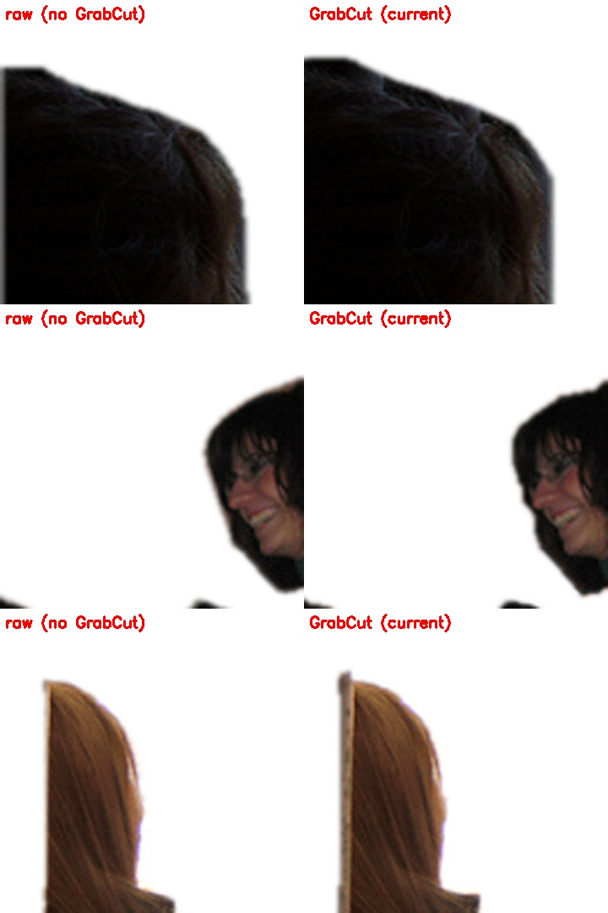

# 지정하지 않은 인물·동물·물체가 대상에 섞여 안 지워지는 문제 — 원인 진단과 수정 (2026-10-08)

**증상**: "남기라고 지정한 대상만 가리켰는데(LLM 해석은 맞음), 그 외 언급 안 된 물체·인물·동물이 같이 잡혀서 남은 대상에 붙어 안 지워진다."

감으로 고치지 않고 **정답 주석으로 섞임을 직접 재는 평가 도구를 만들어 가설을 하나씩 검증**했다.
도구: [`scripts/experiments/leak_eval.py`](../../scripts/experiments/leak_eval.py) (사진/영상 쪽) · [`parse_rounds.py`](../../scripts/experiments/parse_rounds.py) (문장 해석 쪽)

> 요약
> - 원인은 **네 곳**에 있었다: ① 경계 정제(GrabCut)가 이웃 조각을 끌어옴 ② CLAHE 전처리가 검출·선택을 해침 ③ 인스턴스 마스크가 서로 겹쳐 남의 픽셀이 대상에 포함됨 ④ LLM 이 꺼졌을 때 쓰는 키워드 파서가 언급한 물체를 전부 대상으로 잡음
> - 수정 후(6개 시나리오 합산 458장): 섞임 **6.3% → 4.1%**, 5%를 넘게 섞인 사진 **20.7% → 11.5%**, 경계 F **0.52 → 0.61**, 선택 정확 **88.5% → 91.1%**
> - 문장 쪽: LLM 이 꺼졌을 때의 키워드 파서 대상 정확도 **56.6% → 99.1%**(213문장, 다만 규칙을 보며 고친 개발 문장). **처음 보는 문장**에서는 홀드아웃 40개 97.5%, 새 30개 86.7%(고치기 전) — 이 값이 일반화에 가깝다
> - LLM 은 같은 문장에도 답이 흔들린다(대상 0.97~0.99) → 키워드 파서가 중재하는 **LangChain 체인**: 처음 보는 30문장에서 첫 답만 86.7% → 체인 96.7%(호출 평균 1.4번)
> - **효과 없던 것도 기록**: 입력 크기 키우기·NMS·신뢰도 조정·더 큰 모델·낮은 신뢰도 재시도·"붐빔" 신호는 개선이 없거나 역효과였다
> - 총 **107개 사진 라운드**(라운드마다 12~100장, 모두 정답 주석 대비) + **문장 해석 13라운드**(143문장 × [LLM 3종 × 3회 + 키워드 파서 1회] + 처음 보는 30문장 × 3회)

## 1. 측정 방법

COCO val2017 **인스턴스 정답 폴리곤**(사람·동물·물체 전부)으로, 사용자가 지정한 인스턴스를 `target`, 그 밖의 모든 정답 인스턴스(다른 사람·개·가방·의자…, target 과 겹친 부분은 target 몫)를 `others` 로 둔다.
서빙과 같은 경로(전처리 → 세그 → 인스턴스 선택 → 원본 크기 → 경계 정제 → 효과)를 돌려 단계별 마스크 M 을 잡는다.

| 지표 | 뜻 |
|------|-----|
| **섞임(leak)** | \|M ∩ others\| / \|M\| — 핵심. 낮을수록 좋다 |
| 5% 초과 사진 | 섞임이 5%를 넘어 눈에 띄는 사진의 비율 |
| IoU · 덮음 · 경계 F | 대상과의 겹침 · 대상을 얼마나 덮었나 · 경계 일치(DAVIS 식, 허용 오차 대각선의 0.4%) |
| 선택 정확 | 고른 인스턴스가 정답 대상과 IoU 0.5 이상 |
| 검출 재현 · 합쳐짐 | 눈에 띄는 대상을 검출했나 · 두 사람이 한 덩어리로 합쳐졌나 |

단계별(선택 직후 / 정제 직전 / 최종)로 잡아 **어디서 새는지** 갈랐다. 시나리오: 가장 왼쪽·오른쪽·가장 큰·왼쪽에서 두 번째 사람, 맞닿은 두 사람, 사람 전부, 사람 한 명+주변 물체, 개·고양이·말·양·코끼리·자동차만, 왼쪽 사람 지우기.

**측정 자체의 결함을 먼저 고쳤다.** 첫 측정은 (1) 클래스 단위 요청에서 모델이 정확히 잡은 작은 사람·차를 "섞임"으로 셌고, (2) 위치 요청의 정답 후보를 큰 사람만으로 한정해 선택기(1% 이상을 후보로 봄)와 정의가 어긋나 "엉뚱한 사람을 골랐다"가 가짜로 부풀었다.
정의를 바로잡고(같은 클래스 전체가 대상 · 모호한 사진 제외) 다시 쟀다 — 선택 정확 65%대 → 81~90%, 섞임 평균이 절반으로 내려왔다. 모호한 사진까지 넣은 라운드(A11)는 따로 남겼다.

## 2. 기준선 — 현재 코드에서 얼마나·어디서 새나 (A 라운드)

| 라운드 | 시나리오 | 사진 | 선택 정확 | 섞임(최종) | 5% 초과 사진 | 선택 맞은 사진만: 선택 직후 → 정제 후 섞임 | 검출 재현 | 합쳐짐 |
|---|---|---|---|---|---|---|---|---|
| A01 | left | 48 | 90% | 7.2% | 21% | 2.3% → 3.1% | 91% | 12% |
| A02 | right | 48 | 81% | 8.0% | 21% | 0.7% → 1.6% | 91% | 12% |
| A03 | largest | 48 | 90% | 5.7% | 19% | 1.3% → 2.1% | 91% | 12% |
| A04 | rank2 | 48 | 88% | 12.7% | 27% | 2.1% → 3.9% | 95% | 6% |
| A05 | all_persons | 48 | - | 3.9% | 28% | 3.9% | - | - |
| A06 | touching | 48 | 90% | 7.4% | 25% | 3.4% → 4.5% | 93% | 15% |
| A07 | dog | 32 | - | 2.2% | 10% | 2.2% | - | - |
| A08 | cat | 13 | - | 5.9% | 23% | 5.9% | - | - |
| A09 | car | 27 | - | 7.1% | 20% | 7.1% | - | - |
| A10 | remove_left | 48 | 90% | 6.5% | 15% | 2.3% → 2.3% | 91% | 12% |
| A11 | left_loose | 48 | 77% | 12.3% | 25% | 0.8% → 1.6% | 92% | 8% |
| A12 | one_person_with_objects | 48 | - | 4.1% | 28% | 4.1% | - | - |
| A13 | horse | 38 | - | 2.2% | 8% | 2.2% | - | - |
| A14 | sheep | 12 | - | 0.7% | 0% | 0.7% | - | - |
| A15 | elephant | 21 | - | 0.7% | 5% | 0.7% | - | - |

- 선택이 **맞은 사진에서도** 정제 단계가 섞임을 키운다: 선택 직후 2.3% → 정제 후 3.1%(왼쪽), 2.1% → 3.9%(둘째 사람, 사진의 19% 가 5% 초과), 3.4% → 4.5%(맞닿은 두 사람)
- 사람 외 물체가 섞이는 경우(사람 전부 · 사람+주변 물체 · 고양이 · 자동차)는 평균 4~7%, 사진의 20~28% 에서 5% 를 넘는다
- 두 사람이 한 덩어리로 합쳐진 사진이 6~15%, 눈에 띄는 대상을 검출하지 못한 경우가 약 9%, 위치 선택이 틀린 사진이 10~19%

## 3. 가설별 검증 (B 라운드, 같은 사진으로 기준선과 짝지어 비교)

| 라운드 | 가설·변형 | 사진 | 선택 정확 | 섞임 | 5% 초과 | IoU | 덮음 | 합쳐짐 |
|---|---|---|---|---|---|---|---|---|
| B01 | H1 GrabCut 끔 (left) | 48 | 90% | 6.6% | 17% | 0.783 | 0.857 | 12% |
| B02 | H1 맞닿은 사람 + GrabCut 끔 (touching) | 48 | 90% | 6.6% | 19% | 0.784 | 0.869 | 15% |
| B03 | H1 둘째 사람 + GrabCut 끔 (rank2) | 48 | 88% | 11.4% | 21% | 0.745 | 0.814 | 6% |
| B04 | H1 사람 전부 + GrabCut 끔 (all_persons) | 48 | - | 3.0% | 17% | 0.818 | 0.909 | - |
| B05 | H4 겹침 덜어내기: 전부(subtract) (left) | 48 | 90% | 7.0% | 21% | 0.774 | 0.858 | 12% |
| B06 | H4 맞닿은 사람 + subtract (touching) | 48 | 90% | 7.1% | 23% | 0.775 | 0.870 | 15% |
| B07 | H4 맞닿은 사람 + 신뢰도 높은 쪽 소유(conf) (touching) | 48 | 90% | 7.2% | 23% | 0.775 | 0.871 | 15% |
| B08 | H4 맞닿은 사람 + 앞사람 소유(front) (touching) | 48 | 90% | 7.2% | 23% | 0.775 | 0.871 | 15% |
| B09 | H5 맞닿은 사람 + 금지 구역만 (touching) | 48 | 90% | 6.2% | 19% | 0.773 | 0.854 | 15% |
| B10 | H5 둘째 사람 + 금지 구역만 (rank2) | 48 | 88% | 11.0% | 19% | 0.724 | 0.785 | 6% |
| B11 | H4+H5 subtract + 금지 구역 (left) | 48 | 90% | 6.2% | 17% | 0.767 | 0.840 | 12% |
| B12 | H4+H5 맞닿은 사람 + subtract + 금지 구역 (touching) | 48 | 90% | 6.1% | 19% | 0.772 | 0.850 | 15% |
| B13 | H4+H5 둘째 사람 + subtract + 금지 구역 (rank2) | 48 | 88% | 10.6% | 17% | 0.721 | 0.777 | 6% |
| B14 | H6 사람 전부 + subtract + 금지 구역 (all_persons) | 48 | - | 1.8% | 8% | 0.799 | 0.878 | - |
| B15 | H6 사람 한 명+물체 + subtract + 금지 구역 (one_person_with_objects) | 48 | - | 1.8% | 6% | 0.815 | 0.886 | - |
| B16 | H6 자동차 + subtract + 금지 구역 (사람이 안 섞이나) (car) | 27 | - | 5.4% | 12% | 0.715 | 0.831 | - |
| B17 | H6 고양이 + subtract + 금지 구역 (cat) | 13 | - | 5.2% | 8% | 0.817 | 0.858 | - |
| B18 | H2 입력 크기 960 (left) | 48 | 92% | 5.8% | 25% | 0.784 | 0.871 | 17% |
| B19 | H2 맞닿은 사람 + 입력 크기 1280 (touching) | 48 | 85% | 13.0% | 54% | 0.677 | 0.792 | 29% |
| B20 | H2 맞닿은 사람 + NMS iou 0.5 (touching) | 48 | 90% | 7.4% | 23% | 0.774 | 0.873 | 10% |
| B21 | H3 맞닿은 사람 + 신뢰도 0.15 (touching) | 48 | 92% | 6.4% | 21% | 0.783 | 0.873 | 15% |
| B22 | H3 신뢰도 0.4 (left) | 48 | 92% | 7.4% | 23% | 0.789 | 0.881 | 10% |
| B23 | H7 CLAHE 전처리 끔 (left) | 48 | 94% | 5.3% | 15% | 0.802 | 0.881 | 12% |

| 가설 | 결과 |
|------|------|
| H1 경계 정제(GrabCut)가 이웃 조각을 끌어온다 | **확인.** 끄면 섞임 감소(왼쪽 3.1→2.4%, 둘째 사람 3.9→2.2%, 맞닿은 4.5→3.5%)하고 IoU 도 오히려 오른다 |
| H4 겹침 덜어내기만 | 효과 미미 (맞닿은 사람 4.5→4.2%) — 이웃 조각을 GrabCut 이 도로 가져오기 때문 |
| H4+H5 덜어내기+금지구역 | 둘째 사람 3.9→1.4%, 사람 전부 3.9→1.8%, 사람+물체 4.1→1.8% (대상 덮음 −3.5%p) |
| H2 입력 크기 키우기 | **역효과.** 960 은 합쳐짐 증가, 1280 은 합쳐짐 15→29%·검출 재현 93→84% (모델은 640 기준 학습) |
| H2 NMS iou 0.5 | 합쳐짐 15→10% 로 소폭 감소하나 섞임은 그대로 — 채택하지 않음 |
| H3 신뢰도 0.15 / 0.4 | 0.15 는 검출 재현 소폭↑, 섞임 소폭↓ — 잡음 범위 |
| H7 CLAHE 전처리 | **끄니 개선** (선택 정확 90→94%, 섞임 7.2→5.3%) |

## 4. 레시피 비교 — 더 많은 사진으로 확정 (D 라운드, 6개 시나리오 × 레시피 6개)

| 레시피 | 설명 | 섞임 | 5% 초과 사진 | IoU | 덮음 | 경계 F | 선택 정확 |
|--------|------|------|-------------|-----|------|--------|----------|
| R0 | 현재(기준) | 6.3% | 20.7% | 0.775 | 0.879 | 0.516 | 88.5% |
| R1 | CLAHE 끔 | 5.4% | 20.3% | 0.789 | 0.891 | 0.527 | 91.1% |
| R2 | CLAHE 끔 + GrabCut 끔 | 4.6% | 15.3% | 0.805 | 0.884 | 0.608 | 91.1% |
| R3 | R2 + 겹침 덜어내기 (**채택**) | 4.1% | 11.5% | 0.806 | 0.876 | 0.608 | 91.1% |
| R4 | CLAHE 끔 + 덜어내기 + 금지 구역(GrabCut 유지) | 3.9% | 10.2% | 0.787 | 0.862 | 0.533 | 91.1% |
| R5 | R3 + 신뢰도 0.15 | 3.6% | 11.4% | 0.798 | 0.870 | 0.600 | 90.8% |

사진별 쌍 비교(95% 신뢰구간이 0 을 벗어나면 `*`):

| 변경 | 섞임 | IoU | 경계 F |
|------|------|-----|--------|
| R0 → R2 · left (n=100) | -1.4%p* | +0.026* | +0.073* |
| R0 → R2 · rank2 (n=62) | -4.9%p* | +0.056* | +0.105* |
| R0 → R2 · touching (n=99) | -1.1%p* | +0.017* | +0.063* |
| R0 → R2 · all_persons (n=96) | -1.3%p* | +0.026* | +0.092* |
| R0 → R2 · one_person_with_objects (n=65) | -1.2%p* | +0.020* | +0.070* |
| R0 → R2 · car (n=24) | -0.8%p | +0.034* | +0.145* |
| R0 → R3 · left (n=100) | -1.8%p* | +0.026* | +0.072* |
| R0 → R3 · rank2 (n=62) | -5.1%p* | +0.056* | +0.106* |
| R0 → R3 · touching (n=99) | -1.1%p | +0.012 | +0.059* |
| R0 → R3 · all_persons (n=96) | -2.1%p* | +0.029* | +0.090* |
| R0 → R3 · one_person_with_objects (n=65) | -2.3%p* | +0.026* | +0.075* |
| R0 → R3 · car (n=24) | -1.3%p* | +0.034* | +0.142* |

- **R2 (CLAHE 끔 + GrabCut 끔)**: 6개 시나리오 중 5개에서 섞임이 유의하게 줄고, 경계 F 가 모든 시나리오에서 +0.06~0.14 오른다. 속도도 빨라진다
- **R3 (+ 겹침 덜어내기)**: 사람 외 물체가 섞이는 경우(사람 전부 −2.1%p · 사람+물체 −2.3%p · 자동차 −1.3%p)에서 R2 보다 추가로 줄어든다 → **채택**
- R4(GrabCut 유지 + 금지 구역): 섞임은 줄지만 IoU·경계 F 가 R3 보다 낮다 → 옵션으로만 둠
- R5(R3 + 신뢰도 0.15): 추가 이득 없음

GrabCut 이 정답에서 불리할 수 있다는 의심(정답이 COCO 폴리곤 = 모델 학습 스타일)을 눈으로 확인했다:



세 번째 사진은 GrabCut 쪽에 **배경 띠가 따라 붙었고**, 첫 번째는 바깥으로 각진 영역이 늘었다. 두 번째처럼 머리카락 결은 GrabCut 이 조금 더 선명한 경우도 있어 기본은 끄고 `MASK_GRABCUT=true` 옵션으로 남겼다.

## 5. 남은 오선택(약 10%)의 원인 — 모델 크기로는 안 풀린다 (E 라운드)

선택이 틀린 사진의 원인을 분류하면(R0): 정답 대상을 **아예 못 찾음** 6/11 · 7/9 · 3/9, **두 사람이 합쳐짐** 4/11 · 2/9 · 4/9, 그 밖(순서 규칙 등) 소수. 후처리가 아니라 세그 모델 자체의 한계다.

| 모델 | 시나리오 | 사진 | 선택 정확 | 섞임 | 5% 초과 | IoU | 경계 F | 검출 재현 | 합쳐짐 |
|---|---|---|---|---|---|---|---|---|---|
| yolo26s | left | 100 | 89% | 3.7% | 12% | 0.779 | 0.558 | 90% | 10% |
| yolo26s | rank2 | 62 | 81% | 10.9% | 24% | 0.711 | 0.582 | 88% | 13% |
| yolo26s | touching | 100 | 86% | 5.9% | 17% | 0.750 | 0.507 | 88% | 14% |
| yolo26m | left | 100 | 91% | 4.7% | 11% | 0.806 | 0.606 | 96% | 7% |
| yolo26m | rank2 | 62 | 90% | 7.2% | 18% | 0.784 | 0.648 | 95% | 5% |
| yolo26m | touching | 100 | 92% | 4.0% | 12% | 0.805 | 0.579 | 95% | 8% |
| yolo26l | left | 100 | 91% | 5.0% | 10% | 0.799 | 0.610 | 96% | 4% |
| yolo26l | rank2 | 62 | 92% | 6.0% | 14% | 0.792 | 0.652 | 97% | 3% |
| yolo26l | touching | 100 | 94% | 3.1% | 9% | 0.814 | 0.593 | 96% | 5% |
| yolo26x | left | 100 | 89% | 4.4% | 9% | 0.794 | 0.617 | 96% | 5% |
| yolo26x | rank2 | 62 | 89% | 9.7% | 16% | 0.771 | 0.645 | 97% | 3% |
| yolo26x | touching | 100 | 91% | 2.9% | 9% | 0.802 | 0.598 | 95% | 6% |

모델 쌍 비교(사진별 차이, 95% 신뢰구간): m→l 선택 +1.5%p[−1.5,+4.6], 섞임 −0.6%p, 처리시간 +0.36초*(1.9배) — **유의한 이득 없음**. m→x 도 같다. m→s 는 선택 −6.5%p*, 경계 F −0.06* 로 **유의하게 나쁘다**. 기본 모델은 m 그대로 둔다.

## 6. 서빙 중 알 수 있는 위험 신호와 재시도 (F · G 라운드)

정답 없이도 알 수 있는 신호를 기록하고(`meta.leak`) 실제 섞임·오선택과의 상관을 AUC 로 쟀다(사진 675장):

| 신호 | 섞임>5% | 선택 틀림 | 실패(IoU<0.5) |
|------|---------|----------|--------------|
| `conf_min` (고른 인스턴스 최소 신뢰도, 낮을수록 위험) | **0.69** | **0.74** | **0.75** |
| `removed`(덜어낸 비율) · `touching`(맞닿은 인스턴스 수) · `crowd`(붐빔) | 0.59~0.65 | 0.47~0.60 | 0.50~0.59 |
| `big_ratio`(비정상적으로 큰 덩어리) | 0.45 | 0.37 | 0.38 |

- **내가 세운 가설 "붐비면 섞인다"(touching·crowd·removed)는 틀렸다** — 거의 무의미(AUC 0.5~0.65, 위험 규칙의 정밀도 14% = 기저율 13%). 폐기
- `conf_min<0.4` 는 사진의 10% 를 골라 그중 31% 가 문제(무작위의 2.4배)
- 이 신호로 **재시도 경로를 타게 하면 좋아질까?** 게이트(0.5·0.6·0.7)를 LangGraph 검증에 붙여 같은 사진으로 쌍 비교했다 → **선택 정확·섞임·IoU·경계 모두 변화 ≈ 0** (신뢰구간이 0 을 포함). 낮은 신뢰도에서 다시 해도 같은 결과로 돌아온다. **재시도 트리거 가설은 폐기하고 코드를 지웠다**
- 신호는 "어려운 사례를 골라 학습 후보로 모으는" 용도로만 쓴다 (`HARD_EXAMPLE_CONF`, 기본 꺼짐)

## 7. 문장 해석 쪽 (parse_rounds)

143문장(eval 40 · ext 56 · 방해물 47) × 파서별 3회. 대상 정확도(target_ok)와 지정하지 않은 것까지 대상에 넣은 "초과"(extra) 수:

| 파서 | 라운드별 대상 정확 | 평균 | 방해물 문장 정확(평균) | 초과(평균) | 3번 다수결 | 같은 답 일관성 |
|---|---|---|---|---|---|---|
| 키워드 파서(폴백) | 1.000 | 1.000 | 1.000 | 0.0 | - | 1.000 |
| Ollama gemma4:e4b | 0.979 / 0.993 / 0.972 | 0.981 | 0.943 | 2.3 | 0.986 | 0.923 |
| Ollama + RAG(시드 800) | 0.986 / 0.965 / 0.986 | 0.979 | 0.936 | 2.7 | 0.986 | 0.902 |
| Ollama + RAG(시드 + 방해물 학습 180) | 0.986 / 0.986 / 0.993 | 0.988 | 0.965 | 1.7 | 0.993 | 0.909 |

- **LLM 은 같은 문장에도 물을 때마다 달라진다** — 순수 Ollama 의 대상 정확도가 라운드마다 0.97~0.99, 방해물 문장은 0.92~0.98 로 흔들리고 "초과"가 1~4건씩 간헐적으로 나왔다. 이 "초과"가 사진에서 지정하지 않은 것이 같이 남는 문장 쪽 원인이다

### 체인 정책 시뮬레이션 (저장된 LLM 답 3회로 추가 호출 없이 비교)

A 첫 답만(현재) · B 3번 다수결 · C 체인(첫 답이 키워드 파서와 같으면 확정, 다르면 LLM 3답 + 키워드 한 표) · D 키워드 파서만

| 문장 집합 | A | B | **C 체인** | D | C 의 "초과" | C 의 LLM 호출 |
|---|---|---|---|---|---|---|
| **처음 보는 30문장, 키워드 파서 규칙 보강 전 (blind, 동결 값)** | 0.867 | 0.933 | **0.967** | 0.867 | 2 → 0 | 1.40번 |
| 개발 143문장 (키워드 파서가 이 문장들로 만들어져 D 가 낙관적) | 0.979 | 0.986 | **0.986** | 1.000 | 2 → 2 | 1.04번 |
| 같은 30문장, 키워드 파서 규칙 보강 **후** (더는 blind 아님) | 0.867 | 0.933 | **0.967** | 0.933 | 2 → 0 | 1.27번 |

- **blind 값이 일반화 성능에 가깝다**: 키워드 파서가 규칙을 만들기 전에 보지 않은 문장 30개에서 첫 답만 쓰면 86.7%, 3번 다수결 93.3%, **체인 96.7%** ("초과" 2 → 0, LLM 호출 평균 1.4번)
- 개발 143문장에서는 체인 이득이 작다(0.979 → 0.986, +0.7%p) — LLM 이 이미 98% 라 올릴 여지가 적고, 키워드 파서 단독(1.000)이 더 높게 나오는 것은 그 파서를 이 문장들로 만들었기 때문이다(순환)
- 체인은 평소(LLM 과 키워드 파서가 같은 대상을 낼 때) 호출이 1번이라 지연이 늘지 않고, 갈릴 때만 최대 3번까지 묻는다 (개발 문장 평균 1.04번 · fresh 1.27~1.40번)
- 키워드 파서를 전적으로 따르는 정책(E)은 LLM 보다 나을 게 없다 — 중재자는 다수결의 한 표로만 쓴다 (LLM 답이 3번 모두 같으면 LLM 이 이긴다)

### RAG (새 학습 내용의 즉시 반영)

- Ollama + RAG(시드 800): 대상 평균 0.979 (순수 0.981 대비 -0.002), 방해물 문장 평균 0.936
- Ollama + RAG(시드 + 방해물 학습 180): 대상 평균 0.988 (순수 0.981 대비 +0.007), 방해물 문장 평균 0.965
- **시드 800문장만 지식 베이스로 쓰면 이득이 없다**(-0.002) — 서비스가 시드를 기본 제외하는 이유와 같다
- **방해물 학습 문장을 더하면 방향은 좋다**: 평균 +0.007, 방해물 문장 +0.022, 라운드 편차도 줄었다(0.986~0.993). 다만 라운드 편차(±0.01~0.02) 안이라 **통계적으로 확정할 수 없다**. 학습 문장을 평가 문장과 같은 템플릿 계열로 만들었으므로 실제 효과는 이보다 작을 수 있다
- 이 PC 의 학습 DB 에는 승인된 샘플이 없어 서비스 RAG 는 빈 색인이었다 (그래서 지식 베이스를 직접 만들어 쟀다). 운영에서는 승인된 교정이 쌓일수록 같은 문장·비슷한 문장에 즉시 반영된다

## 8. 바뀐 것

| 위치 | 변경 |
|------|------|
| `services/mask_exclusion.py` (신규) | 겹침 소유권(subtract · conf · front), 금지 구역, 위험 신호, 사진·영상 공용 `finalize_selection` |
| `services/segmentation.py` | 요청하지 않은 인스턴스(`others`)를 결과에 담음, `SEG_IMGSZ`·`SEG_NMS_IOU` 옵션 |
| `services/effects.py` | `refine_mask(use_grabcut, forbid)`, GrabCut 띠·핵심부 상수화 |
| `workflows/nodes.py` | 전처리 입력 선택(CLAHE 기본 꺼짐)·재시도는 반대쪽 입력, 겹침 처리, 신호 기록 |
| `workflows/edges.py` | 어려운 사례(`HARD_EXAMPLE_CONF`)를 학습 후보로도 저장하는 분기 |
| `services/heuristic_targets.py` (신규) | LLM 없는 환경의 키워드 파서: 어휘 확장 + 남길 것/뺄 것/지울 것 역할 규칙 |
| `services/prompt_chain.py` (신규) | LangChain Core 로 조립한 해석 체인 (대상이 갈리면 다수결) |
| 설정 기본값 | `MASK_EXCLUSIVE=subtract` · `MASK_GRABCUT=false` · `PREPROCESS_CLAHE=false` |

## 9. 한계와 솔직한 주의

- 정답은 COCO 폴리곤(거친 편)이라 경계 F 의 절대값은 낮게 나온다 — **방식 사이 비교**가 목적이다
- 남은 오선택(≈10%: 대상 미검출·합쳐짐)과 5% 초과 섞임(≈11%)은 후처리로 안 풀린다. 다음 후보: 검출 보강(SAM2/DINO 제안), 사용자 교정 기반 YOLO 미세 조정
- 시나리오별 사진 수는 12~100장이고 일부(고양이 13·양 12)는 적다. 쌍 비교 신뢰구간으로 판단했고, 잡음 범위인 것은 채택하지 않았다
- 합성 영상·실제 영상의 흔들림은 이전 문서(edge-tuning)에서 다뤘고 이번에는 영상에 같은 소유권 규칙만 적용했다

## 10. 재현

```bash
python scripts/experiments/leak_eval.py --list                       # 라운드 목록
python scripts/experiments/leak_eval.py --rounds A01,A04,B01 --n 48   # 일부만
python scripts/experiments/leak_eval.py --rounds all --n 100 --out docs/vaildates/leak_eval_ALL.json
python scripts/experiments/parse_rounds.py --parsers heuristic,ollama,ollama_rag_seed,ollama_rag_new --repeat 3
```
원자료: `leak_eval_{A,B,D,E,F,G}_20261008.json`, `parse_rounds_20261008.json`
