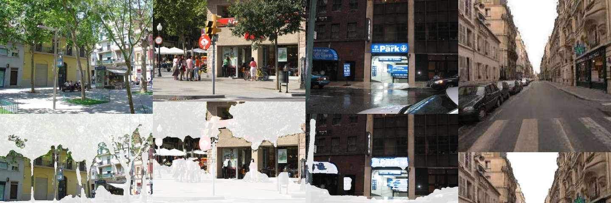
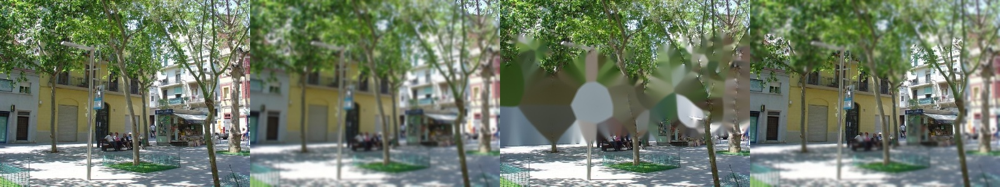

# 건물·하늘·도로 같은 배경 덩어리 인식 — 2026-10-08

"건물 인식이 안 되는 것 같다 — 학습해야 하나?"에서 시작. **새로 학습하지 않고** 사전학습 의미 분할 모델(SegFormer, ADE20K)을 붙였다.

## 1. 왜 안 됐나 · 왜 학습이 아닌가

- 서빙 세그 모델 YOLO26m-seg 은 COCO 80클래스(사람·자동차·개…)만 안다. **건물은 목록에 없다.** 건물·하늘·도로 같은 "덩어리"는 낱개 물체 탐지 모델과 성격도 맞지 않는다
- 오픈 보캐브(Grounding DINO + SAM2)는 이미 있지만 로컬 전용(Docker 슬림 이미지에 torch·transformers 없음)
- ADE20K 로 사전학습된 SegFormer 는 건물·하늘·도로·나무·잔디·물·산·벽·바닥 등 150종을 이미 안다 → **학습 데이터를 만들 필요 없이 바로 쓸 수 있다**
- onnxruntime 만 있으면 돌도록 ONNX 로 내보냈다 → Docker 슬림 이미지에서도 동작 (`scripts/export_stuff_onnx.py`, torch 출력과 최대 오차 3e-05)

## 2. 모델 선택 (ADE20K 검증 100장, 묶음 단위 IoU)

원자료: [`stuff_seg_compare_20261008.json`](./stuff_seg_compare_20261008.json) · 스크립트 [`stuff_seg_compare.py`](../../scripts/experiments/stuff_seg_compare.py)
사용자는 "건물"이라고 말하지 "house"와 "building"을 구분하지 않으므로 **정답·예측을 같은 묶음으로 합쳐** 쟀다 (건물 = building + house + skyscraper + hovel).
예측은 서빙과 똑같이: 클래스 확률을 묶음으로 합산 → 이미지 크기로 선형 확대 → 0.5 임계.

| 모델 | 파일 | 건물 | 하늘 | 도로 | 나무 | 잔디 | 물 | 묶음 평균 | GPU/장 | CPU/장 |
|------|------|------|------|------|------|------|----|---------|--------|--------|
| b0 | 15MB | 0.849 | 0.921 | 0.741 | 0.672 | 0.419 | 0.810 | 0.659 | 25ms | 108ms |
| **b2 (기본)** | 110MB | **0.861** | 0.937 | 0.785 | 0.713 | 0.626 | 0.855 | 0.701 | 55ms | 480ms |
| b5 | 330MB | 0.848 | 0.940 | 0.774 | 0.715 | 0.691 | 0.859 | 0.713 | 89ms | 1,094ms |

- **건물만 보면 세 모델이 사실상 같다** (b5 가 오히려 낮음 — 100장 표본의 오차 범위). 차이는 잔디·인도·물·다리 같은 다른 대상에서 난다
- b2 를 기본으로: b5 의 평균 +0.013 을 위해 CPU 에서 2.3배 느리고 파일은 3배 크다. b0 는 잔디(0.42)가 약하다
- CPU 서버·영상에서 속도가 아쉬우면 `--model nvidia/segformer-b0-finetuned-ade-512-512` 로 다시 내보내 `STUFF_MODEL_PATH` 만 바꾸면 된다
- 주의: 검증 이미지 100장 (데이터 조각 하나가 100장). 건물 외 클래스 중 표본이 적은 것(다리·울타리·땅)은 수치가 흔들린다. **땅(ground) 0.25 · 울타리 0.48 은 약하다**

## 3. 통합

| 위치 | 내용 |
|------|------|
| `services/stuff_segmentation.py` | 전처리, 묶음 확률(`group_probability`), 연결 성분 → 인스턴스, `StuffSegmenter`(ONNX) |
| `services/prompt_spec.py` | `STUFF_GROUPS`(14개 묶음) · 한국어·동의어 별칭 · LLM 지시문·예시 · `canonical_target` |
| `workflows/nodes.py` | 휴리스틱 파서 키워드 (건물·하늘·도로·나무·잔디·바다·산맥·울타리) |
| `services/segmentation.py` | 덩어리 대상이면 SegFormer, 낱개와 섞이면 YOLO + SegFormer 합집합 (`backend = yolo+segformer`) |
| 설정 | `STUFF_SEG_ENABLED` · `STUFF_MODEL_PATH` · `STUFF_MIN_PROB`(0.5) · `STUFF_USE_GPU` |
| 기동 | 미리 로드·워밍업에 포함, 콘솔 시스템 화면에 모델 상태 |

- 묶음마다 연결된 덩어리(0.3% 이상)를 인스턴스로 내보내 **"왼쪽 건물만"**, **"가장 큰 건물"** 같은 위치·크기 선택이 그대로 된다
- 모델 파일이 없으면 이 경로만 꺼지고 기존 동작 (건물은 "찾지 못했습니다")

## 4. 확인

### 4.1 ADE20K 거리 사진 (건물이 34~64%) — 위: 원본 · 아래: 건물만 남김

건물(위층 창·간판 포함)은 남고 나무·사람·도로·하늘이 지워진다. 인스턴스 1~4개, 신뢰도 0.58~0.98.

### 4.2 Docker 백엔드 실제 요청 (문장 해석 LLM → 파이프라인)

| 문장 | 해석 | 결과 |
|------|------|------|
| 건물만 남기고 배경 제거 | `building` · remove_bg | 건물만 남음 (면적 44%) |
| 하늘 빼고 전부 블러 | `sky` · blur | 하늘만 선명 |
| 왼쪽 건물만 남기고 배경 블러 | `building` · blur · **selector left** | 왼쪽 건물만 선명 |
| 건물 지워줘 | `building` · remove_object | 지워지지만 **번져 보임** (아래) |

### 4.3 한계 — 큰 영역 지우기
건물 크기의 영역을 지우면 OpenCV 기본 인페인팅(Telea)이 주변색을 번지게 메워 부자연스럽다 (세 번째 그림). 코드에 이미 "큰 물체는 학습형 인페인팅(LaMa 등)으로 교체 후보"로 적혀 있던 한계다.
"X 만 남기고 배경 제거/블러"는 깔끔하다. 사용자 가이드에도 이 안내를 넣었다.

## 5. 남은 것
- 큰 영역 지우기: 학습형 인페인팅(LaMa 등) — 별도 작업
- 약한 클래스(땅 · 울타리) 개선, 사용자 데이터로 추가 미세 조정은 측정으로 필요가 확인되면
- LoRA 파서(Qwen 1.5B)는 새 어휘를 학습하지 않았다 — LoRA 를 쓰는 환경에서는 건물이 낱개 물체로 잘못 해석될 수 있어 재학습 필요 (Ollama 등 LLM 경로는 지시문·예시로 해결)
- 실브라우저 화면 확인은 이번에 하지 않았다 (API·Docker 요청과 이미지로 확인)
