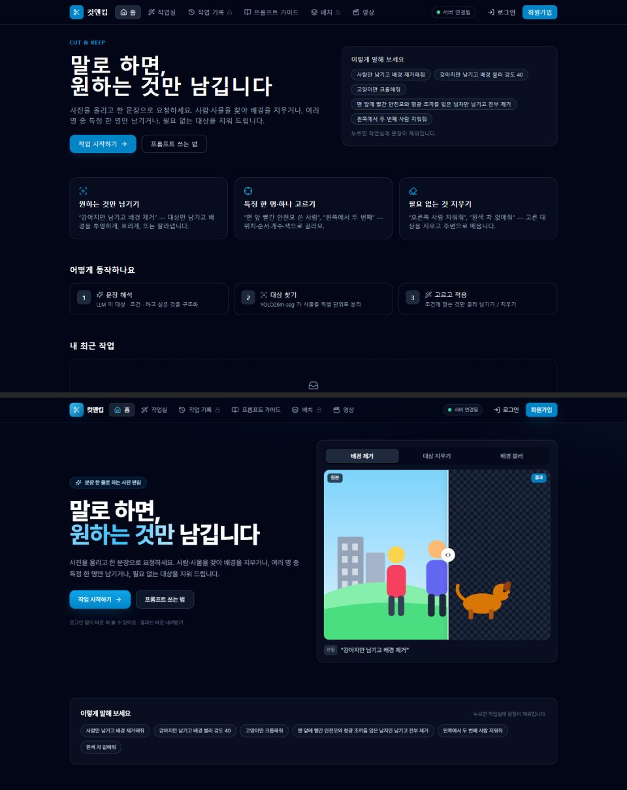
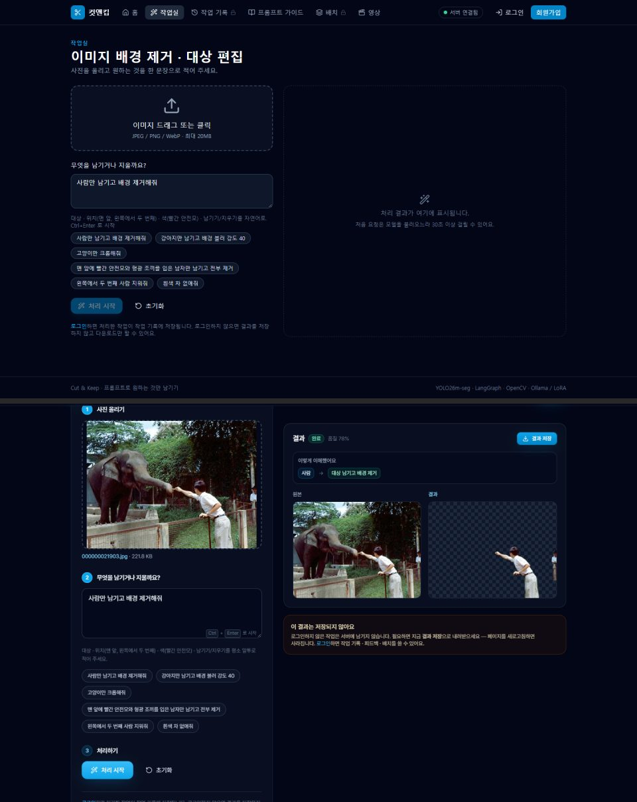
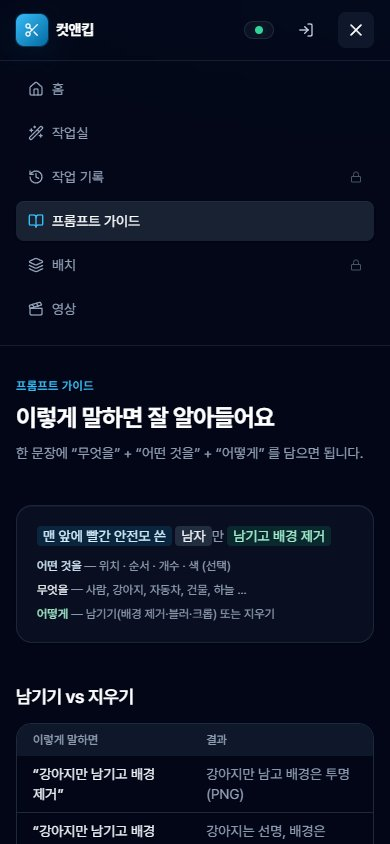

# 사용자 앱 디자인 고도화 — 2026-10-08

다크 테마는 그대로 두고 완성도를 올렸다(사용자 결정: "다크 유지 + 완성도", 범위 "사용자 앱 전체", 운영 콘솔은 제외).
화면 문구와 흐름은 바꾸지 않았다 — 기존 테스트 44개가 문구 기준이라 그대로 통과한다.

## 바뀐 것

| 영역 | 이전 | 이후 |
|------|------|------|
| 글꼴 | Inter 지정 + 한글은 시스템 글꼴(맑은 고딕) | **Pretendard** 가변 글꼴, 동적 서브셋으로 빌드에 포함(외부 CDN 없음) |
| 줄바꿈 | 한국어 낱말 중간에서 줄이 바뀜("배 / 경을") | 전역 `word-break: keep-all` |
| 디자인 토큰 | brand 5단계, 화면마다 카드·입력칸 클래스를 따로 씀 | brand 11단계, 공통 클래스 `card` · `field` · `eyebrow` · `step-dot`, `buttonClass()` 로 링크도 버튼 모양 통일 |
| 홈 | 글 위주 소개 + 예시 칩 | **원본/결과 비교 데모**(SVG 그림, 배경 제거 · 대상 지우기 · 배경 블러 탭, 손잡이를 끌거나 ←/→ 키로 조작), 3단계 사용 순서, 기능 카드 |
| 작업실 | 입력 요소 나열 | **1 사진 · 2 문장 · 3 처리** 단계 머리와 완료 표시, 시작할 수 없는 이유 안내, 결과 칸이 스크롤을 따라옴(넓은 화면), 처리 중 3단계 진행 막대 |
| 업로드 | 미리 보기만 | 사진을 올린 뒤 "다른 사진으로 바꾸기" 안내, 크기·형식 거부 사유 표시 |
| 모바일 메뉴 | 아이콘만 한 줄(무슨 메뉴인지 모름) | 1024px 미만은 **이름이 보이는 펼침 메뉴**, 페이지 이동 시 자동으로 닫힘 |
| 접근성 | 초점 표시가 화면마다 다름 | 키보드 초점 링 통일(`:focus-visible`), 움직임 줄이기 설정 존중, 서버 상태·메뉴에 `aria-label` |
| 기타 | 파비콘 없음 | 브랜드 파비콘, `theme-color` · `description` 메타, 404 화면 정리 |

## 확인

| 항목 | 결과 |
|------|------|
| 프론트 테스트 | vitest 44 통과 · 타입 검사 · 빌드 통과 |
| 화면 18개(데스크톱 1440 · 모바일 390 × 9개 경로) | 가로 스크롤 0건, 스크립트 오류 0건 |
| 비로그인 실제 처리 | 사진 → 문장 → 처리 중(진행 막대) → 결과·해석 칩·결과 저장까지 Docker 백엔드로 확인 |
| 회원 화면(작업 기록 · 작업 상세 · 실패 작업 · 배치) | API 응답을 Playwright 로 가짜로 채워 확인 — 서버에 계정·작업을 만들지 않음 |
| 데모 | 탭 전환, 키보드로 손잡이 이동(55 → 75) |
| Docker 프론트엔드(:80) | 재빌드 후 새 화면, Pretendard woff2 `200 font/woff2` 로 제공 |

## 하지 않은 것

- 운영 콘솔(:5174) 디자인 — 범위 밖
- 밝은 테마 · 테마 전환 — 다크 유지로 결정
- 실제 사진을 쓴 홈 데모 — 저작권·초상권 때문에 SVG 그림으로 대신했다. 실제 결과 사진이 필요하면 직접 찍은 사진으로 교체한다
- 사용자 테스트(실제 사람이 써 보는 것)와 접근성 자동 점검(axe 등)은 하지 않았다
