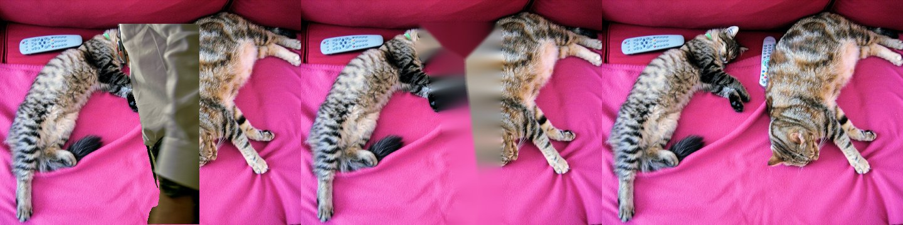

# 영상 · GIF 대상 지우기 — 다른 프레임에서 보인 배경으로 메우기 (2026-10-09)

> 도구: [`scripts/experiments/video_removal_eval.py`](../../scripts/experiments/video_removal_eval.py) · 원자료 [`video_removal_eval_20261009.json`](./video_removal_eval_20261009.json) · 코드 `backend/app/services/video_inpaint.py`

## 문제

사진은 LaMa 로 지운 자리를 메우지만, 영상 · GIF 는 프레임마다 LaMa 를 돌리면 프레임당 1초 넘게 걸리고 프레임마다 다르게 메워져 깜빡인다.
그래서 프레임마다 Telea 로 메웠는데, 큰 물체를 지우면 번진 얼룩이 남고 프레임 사이에 꿈틀거렸다.

## 바꾼 것 — 배경판

카메라가 고정이면 지울 대상이 움직이는 동안 **그 뒤의 배경이 다른 프레임에서 보인다**.

1. 영상을 한 번 훑으며 프레임마다 마스크를 구하고, 마스크 밖 픽셀을 모아 **깨끗한 배경판**을 만든다
2. 카메라 고정 여부를 본다 — 마스크 밖 프레임 간 밝기 차(축소 160px)의 중앙값 < 6 이고 90 백분위수 < 14
3. 영상 내내 가려져 **한 번도 보이지 않은 곳만** 배경판 위에서 LaMa 로 한 번 메운다 (없으면 Telea)
4. 다시 훑으며 지운 자리를 배경판으로 채운다 (경계는 2px 섞음)

카메라가 움직이면 배경판이 어긋나므로 자동으로 예전처럼 프레임마다 Telea. `VIDEO_REMOVE_MODE=frame` 으로 예전 방식 고정.

## 평가 — 정답이 있는 합성 영상

COCO 사진(사람 없는 것)을 배경으로 고정하고 다른 사진의 사람 모양을 잘라 붙인 16프레임(긴 변 480px) 영상. 원래 배경이 정답.
세그멘테이션은 빼고(붙인 자리 = 마스크) 메우기만 잰다. 시나리오마다 20개, 사람 크기는 화면의 8% · 18%.

| 시나리오 | 고정 카메라 판정 | L1 (구멍 안, 낮을수록) | PSNR dB | 깜빡임 (0 이 정답) | 시간 (16프레임) |
|----------|------------------|------------------------|---------|--------------------|-----------------|
| **움직이는 사람** (고정 카메라) | 100% | 26.4 → **0.0** [−29.8, −22.9] | 16.9 → 99 | 22.5 → **0.0** | 0.56 → 0.22초 |
| 제자리에 선 사람 (배경이 안 보임) | 100% | 27.3 → **23.8** [−5.1, −1.8] | 16.6 → 17.4 | 0 → 0 | 0.56 → 1.71초 (LaMa 1번) |
| 카메라 이동 (팬) | 5% (1/20 오판정) | 27.5 → 27.5 [−0.1, 0.0] | 16.5 → 16.6 | 5.2 → 5.1 | 0.56 → 0.71초 |

[ ] 는 쌍 비교 차이의 95% 신뢰구간.

왼쪽부터 원본(사람이 지나가는 중), 예전 방식(번진 얼룩), 배경판(고양이 머리 · 리모컨이 그대로 돌아옴).

## 해석과 한계

- 움직이는 대상의 L1 0 은 **합성 영상이라 배경이 완전히 고정**돼서다. 실제 영상은 조명 변화 · 센서 잡음 · 미세한 흔들림 · 그림자가 있어 0 이 되지는 않는다 — 그래도 "실제로 보였던 배경"을 쓰므로 번짐보다 훨씬 자연스럽다
- 지울 대상의 **그림자 · 반사**는 마스크에 없어서 남는다 (사진도 같다)
- 카메라가 조금이라도 움직이면 예전 방식으로 돌아간다 — 손떨림 보정(영상 정합) 후 배경판을 만드는 것은 후속
- 영상을 두 번 읽는다 (메모리: 마스크는 비트로 압축, 1080p 240프레임 약 60MB + 배경 누적 25MB)

## LaMa 입력 수정 (같은 날 발견)

배경판의 "안 보인 곳"을 LaMa 로 메우다가, 이 ONNX 판이 **구멍 안 픽셀을 참고하고, 축소할 때 구멍 테두리 1~2px 에 안쪽 색이 섞여 들어간다**는 것을 확인했다
(구멍을 검정으로 넣으면 메운 자리가 어둡게 물듦). 그래서 모델 해상도에서 구멍을 5px 넓히고 그 안을 비워 넣는다 (`services/inpaint.py`).
사진 경로는 원래 구멍을 넓혀서 넣고 있어 영향이 작았지만, 지울 대상의 색이 테두리로 새지 않게 하는 쪽이 맞아 같이 고쳤다.
사진 평가를 다시 돌린 값으로 [inpaint-20261009.md](./inpaint-20261009.md) 를 고쳤다 (L1 15.6 → 16.2, 여전히 Telea 20.2 보다 낫다).
